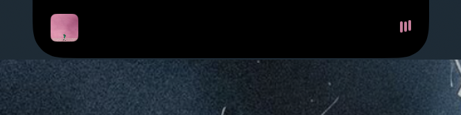
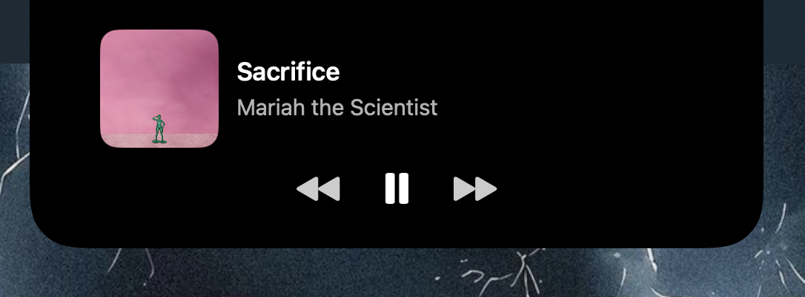

# Notchtify

Transform your MacBook’s notch into a Dynamic Island for Spotify.

Notchtify creates an interactive notch for MacBooks that have a notch, notchtify shows what’s playing on Spotify, with album art, status, and quick controls.

### Compact View (Playing)

  

### Expanded View (Playing)

  

---

## Features

- Dynamic Island-style UI at the notch
- Spotify detection: running/playing status
- Live album artwork via Spotify Web API
- Playback controls: play/pause, next, previous
- Auto-expand on track change
- Hover enlarge
- Lightweight SwiftUI + AppKit implementation

---

## Requirements

- macOS 15+
- Spotify desktop app
- Internet connection (for album art)

---

## Install

1) Clone the repo
- git clone https://github.com/patricknelwan/notchtify.git
- cd notchtify
- Open the project in Xcode and build

2) First launch
- Open Spotify desktop
- Launch Notchtify
- Grant Accessibility permissions if prompted
- Start playing music

---

## Configuration
Album art requires Spotify Web API credentials. Choose one of the following methods:

### Method 1: Environment Variables (Recommended)
1) Create an app at [Spotify Developer Dashboard](https://developer.spotify.com/dashboard)
   - Create App → note Client ID and Client Secret
2) In Xcode:
   - Go to Product → Scheme → Edit Scheme
   - Select "Run" → "Arguments" → "Environment Variables"
   - Add:
     - `SPOTIFY_CLIENT_ID`: Your Spotify Client ID
     - `SPOTIFY_CLIENT_SECRET`: Your Spotify Client Secret

### Method 2: Config.plist (Alternative)
1) Create an app at [Spotify Developer Dashboard](https://developer.spotify.com/dashboard)
   - Create App → note Client ID and Client Secret
2) Configure the app:
   - Copy `Config.plist.example` to `Config.plist`
   - Fill in your actual `SpotifyClientID` and `SpotifyClientSecret`

---

## Usage

- Click the island to expand/collapse
- Hover to enlarge the notch
- Use playback buttons (prev/play-pause/next)

---

## Project Structure

- notchtifyApp.swift — App entry and window wiring
- ContentView.swift — Settings/control panel UI
- FloatingWindowManager.swift — Floating window at the notch
- SpotifyDynamicIsland.swift — Compact/expanded island views
- SpotifyManager.swift — Spotify state via AppleScript, UI state
- SpotifyWebAPIManager.swift — Token + album art fetching
- Config.plist.example — Template for secrets

---

## Development Notes

- SwiftUI for UI; AppKit for window management
- AppleScript reads Spotify state (track, artist, playing)
- Web API fetches album art (Client Credentials flow)
- Borderless floating window positioned at top center

Tip: On first app open with music already playing, album art may need a brief moment; the manager includes retries and delayed fetch on initial detection.

---

## Troubleshooting

Album art not showing
- Verify Config.plist credentials
- Check network connectivity
- Try switching tracks once to refresh metadata

Spotify not detected
- Ensure Spotify desktop app is running
- Restart both Spotify and Notchtify

Click issues on the island
- Ensure Accessibility permissions are granted
- Avoid other apps’ overlays covering the menu bar

---

## Contributing

- Fork → feature branch → PR
- Keep credentials out of git
- UI/UX improvements and bug fixes welcome

---

## ⚠️ Disclaimer

Notchtify is an independent project, not affiliated with or endorsed by Spotify AB or Apple Inc. Dynamic Island is a design by Apple Inc.
